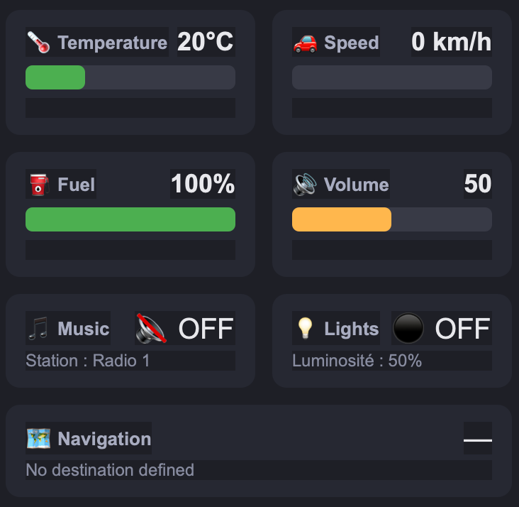
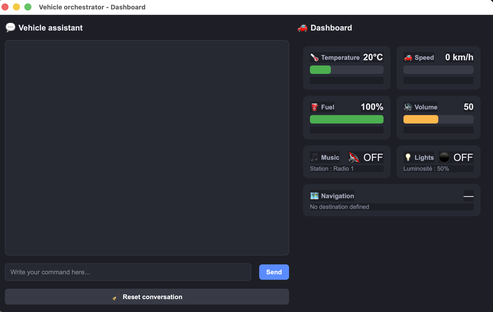
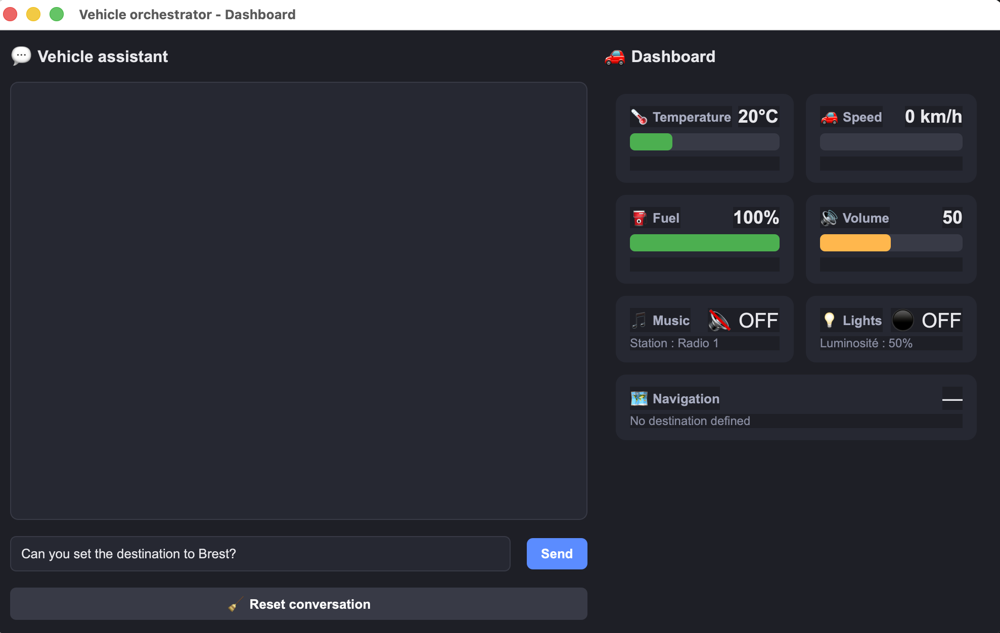
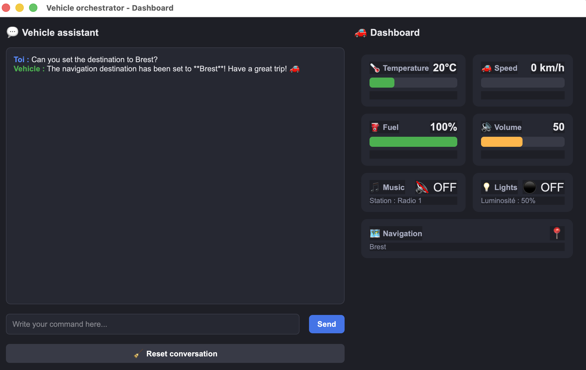
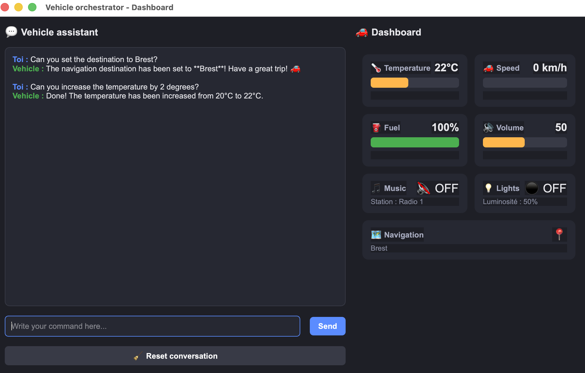
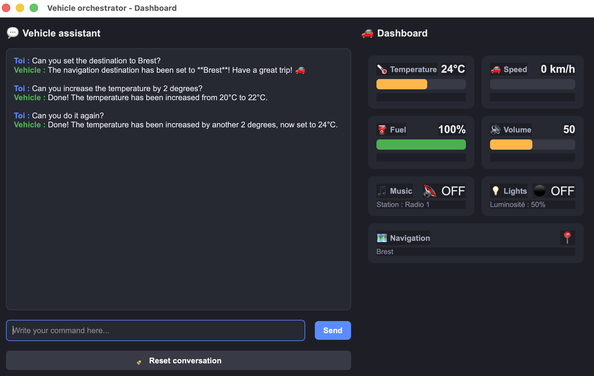
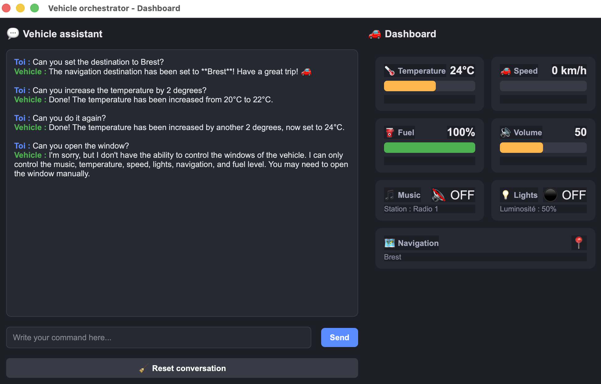

# Vehicle Orchestrator

A vehicle orchestrator that translates commands in natural language into actions, using Claude's API.

## Why this project

I built this project to get hands-on experience with LLM tool calling (function calling) in a practical context. The orchestrator takes a natural language command from the user (e.g "turn on the lights", "Switch to my favorite radio station.") and lets Claude decide which function to call based on a predefined function map.

## Architecture 

- vehicle_controllers.py : Vehicle class and control functions (Radio, temperature, speed, ...)
- orchestrator.py : Tools definition for Claude, function_map, API call, parsing, memorizes conversation history.
- gui.py : Interface to interact with the orchestrator.
- .env : To save my API Key.

## Demonstration 
### Initialisation 
The vehicle is instantiated with the following parameters : 
- Temperature : 20˚C
- Speed : 0 km/h 
- Fuel : 100%
- Volume : 50
- Music : off, station = radio 1
- Lights : off, luminosity = 50%
- Navigation : No destination defined

### Interface
The interface is composed of two main parts :
- On the left : the terminal, displaying the user's requests and Claude's responses.
- On the right : the vehicle's parameters changing in real-time after the user's request.

### Use 
In the terminal, the user writes a sentence, here : "Can you set the destination to Brest" for example.

The LLM identifies the right function to use, here : set_navigation_destination("Brest").

And it responds to the user in the terminal and the vehicle paramter "Navigation" is updated.

Is also has a memory, it memorizes the previous requests and responses : 

And when requesting to execute the same task, it "remembers" what it was and execute it again :

### Unknown parameters
When asking something it can not interact with (because the parameter and/or the function is not defined or not in the function_map), it prevents the user : 

### Reset conversation
The interface also has a "Reset conversation" button. It is useful because adding a "memory" to the LLM cost more and more tokens as the memory gets filled with the previous messages. reseting the conversation clears the memory.

## Stack 
- Python
- Anthropic Claude API
- PyQT6 (Interface)
- python-dotenv (environment variables management)

## Installation 
bash :
- git clone https://github.com/bizienmaximepro-dev/vehicle-orchestrator.git
- cd vehicle-orchestrator
- pip install -r requirements.txt
- cp .env.example .env
- Add your Anthropic API Key in .env
- python gui.py

